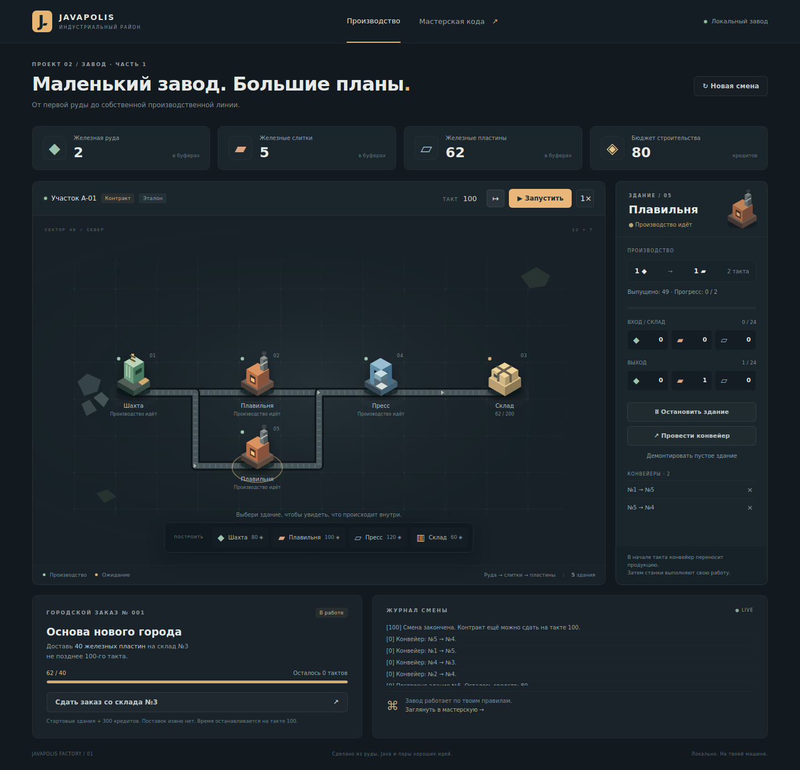

# Завод 1 — курс и локальный шаблон

Пять последовательных практик и 17 глав: склад → добыча → плавильня → пресс → производственный контракт. Ученик меняет пять Java-классов и сразу видит результат в локальной браузерной игре.



Скриншот реального приложения в режиме эталона после 100 тактов.

## Состав

- `course.json` — порядок глав, практики и ссылки на переиспользуемые темы.
- `../../src/main/resources/topics/Завод` — главы для существующего университета JavaPolis, с навигацией, подсказками и полными решениями.
- `starter` — **самостоятельный Maven-проект**, Java 21, Spring Boot 3.5.11, JUnit Jupiter. Запуск не требует JavaPolis, PostgreSQL, Vue, npm или внешних сервисов.
- `starter/solutions` — эталон пяти ученических классов; профиль `solution` собирает его отдельно.
- `tools/PackagePlayer.java` — упаковщик исходников и офлайн-глав на стандартной библиотеке Java.

Учебная экономика целиком в Java. Нативные SVG, CSS и небольшой JavaScript показывают карту, анимации и полученное от сервера состояние. Числа в браузере не подменяют результат ученического кода. Есть стройка, прокладка и удаление конвейеров, несколько реальных станков, пауза, пошаговый режим, причины ожидания и контракт.

## Теория без дубликатов

Базовые темы Колизея используются по ссылкам. Существующая пустая `classes.md` заполнена материалом об объектах; в существующую `advanced/collections.md` добавлены необходимые операции `Map`. В новых главах: enum-ресурсы, инкапсуляция и инварианты, композиция и ссылки, дискретные такты, неизменяемый рецепт, JUnit и граничные проверки.

Многопоточность, сохранения, SQL, Docker и микросервисы оставлены следующим частям. Spring Boot уже работает в оболочке; ученик пока не обязан изучать веб-разработку. Производственное состояние защищено готовым последовательным доступом в `FactoryEngine`.

## Проверить

```bash
cd courses/factory/starter
./mvnw test
./mvnw -Psolution verify
./mvnw -Psolution spring-boot:run
```

В Windows — `.\mvnw.cmd`. Адрес: http://127.0.0.1:8081. Первый запуск требует JDK 21 и интернета для зависимостей. Подробности в `starter/README.md`.

`test` проверяет оболочку; `stage-1` … `stage-5` — задания на ученическом коде; `all-stages` — весь ученический проект; `solution` — готовый эталон. Выходные каталоги ученика и эталона разделены. Контрольный проигрыш с одной плавильней и победа с двумя проверяются тестами вместе с сохранением материалов.

Из корня репозитория тесты публикации глав запускаются вместе с остальными Java-тестами:

```bash
mvn -Dskip.installnodenpm -Dskip.npm test
```

## Архив для ученика

Из корня репозитория на JDK 21:

```bash
java courses/factory/tools/PackagePlayer.java
```

Получится `target/factory-player.zip`. Внутри папка `factory-player`: исходники, wrapper, тесты, решения и `lessons` с оглавлением и относительными ссылками для локального чтения Markdown. Нужные существующие главы включены как копии **только при упаковке**; второго набора теории в репозитории нет. Исполняемые JAR и `target` в архив не попадают.

GitHub Actions собирает такой же архив и прикладывает его как `factory-player`. Временно доступные артефакты Actions можно пересобрать в любой момент из исходников этой ветки.

## Проверка интерфейса для автора

Необязательный профиль `ui` подключает Playwright **Java** и JUnit. Он предназначен для автора и CI, не нужен ученику. В CI проверяется реальная страница с Java-сервером, строительство, конвейеры, победный контракт, мобильная ширина и повторное подключение. Скриншоты прикладываются к запуску Actions.

```bash
cd courses/factory/starter
./mvnw -Psolution,ui test-compile exec:java -Dexec.mainClass=com.microsoft.playwright.CLI -Dexec.classpathScope=test -Dexec.args="install --with-deps chromium"
./mvnw -Psolution,ui test
```

Сверка материала: [Oracle Java 21 API](https://docs.oracle.com/en/java/javase/21/docs/api/index.html), [Oracle Classes and Objects](https://docs.oracle.com/javase/tutorial/java/javaOO/), [JUnit 5](https://docs.junit.org/5.12.2/user-guide/), [Spring Boot](https://docs.spring.io/spring-boot/3.5/reference/web/servlet.html). Ссылки на конкретные разделы стоят в главах.
